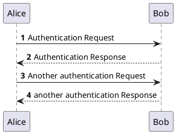
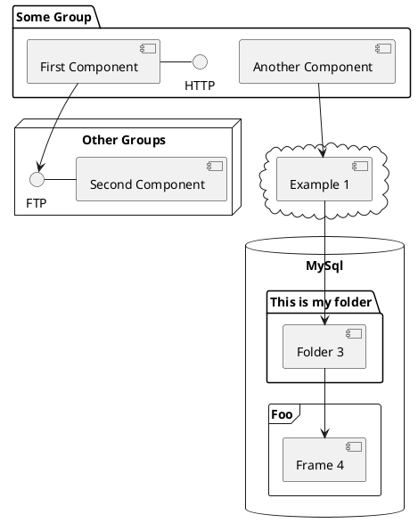

……什么时候走payoneer提现都要对货单和发票了……

唉

吾等黄油技师的日子越来越难混了啊

### 1. SDL_GameControllerDB_Util发新版本

### 2. 给博客加上plantUML渲染支持

```shell
npm install hexo-tag-plantuml --save
```

哇，竟然已经有带善人做了相应的hexo插件诶

那嫖来用一下就好了

爽到

例1 代码:



例1 渲染效果:


@startuml
'https://plantuml.com/sequence-diagram

autonumber

Alice -> Bob: Authentication Request
Bob --> Alice: Authentication Response

Alice -> Bob: Another authentication Request
Alice <-- Bob: another authentication Response
@enduml


例2 代码:



例2 渲染效果:


@startuml
'https://plantuml.com/component-diagram


package "Some Group" {
HTTP - [First Component]
[Another Component]
}

node "Other Groups" {
FTP - [Second Component]
[First Component] --> FTP
}

cloud {
[Example 1]
}


database "MySql" {
folder "This is my folder" {
[Folder 3]
}
frame "Foo" {
[Frame 4]
}
}


[Another Component] --> [Example 1]
[Example 1] --> [Folder 3]
[Folder 3] --> [Frame 4]

@enduml


### 3. 完成文献 [尼尔:伪装者测评](/2021/05/05/20210504尼尔_伪装者测评)
