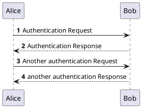
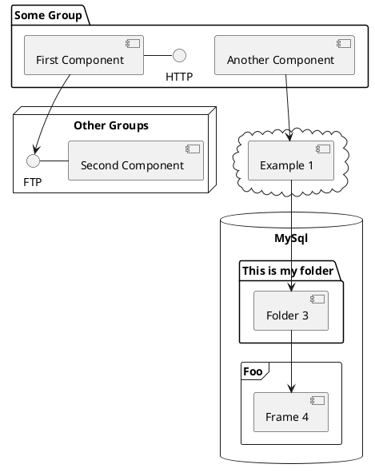

……什么时候走payoneer提现都要对货单和发票了……

唉

吾等黄油技师的日子越来越难混了啊

### 1. SDL_GameControllerDB_Util发新版本

### 2. 给博客加上plantUML渲染支持

### 2.1 hexo端

哇，竟然已经有带善人做了相应的hexo插件诶

那嫖来用一下就好了……好吧，其实不太行

https://github.com/two/hexo-tag-plantuml

因为idea的plantuml要求以\`\`\`plantuml开头的注释段

但是这个插件希望要的是

```html

Alice -> Bob: Authentication Request

```

这种

所以导致如果想要像我一样多端，那么看来是不能用这个了

……当我开始准备好自己写js的时候，奇迹发生了

```http request
https://github.com/search?q=hexo+plantuml
```

搜索hexo plantuml，竟然获得了已经实现了的版本，并且还是两个老哥分别实现了……

https://github.com/miao1007/hexo-filter-plantuml

和

https://github.com/add358/hexo-filter-markdown-plantuml

嗯，出于多种因素考虑，我们最终选择这个 https://github.com/miao1007/hexo-filter-plantuml

```shell
npm install --save hexo-filter-plantuml
```

爽到

### 2.2 idea端

[comment]: <> (TODO)

### 2.3 使用例

例1 代码:

```html
@startuml
'https://plantuml.com/sequence-diagram

autonumber

Alice -> Bob: Authentication Request
Bob --> Alice: Authentication Response

Alice -> Bob: Another authentication Request
Alice <-- Bob: another authentication Response
@enduml
```

例1 渲染效果:



例2 代码:

```html
@startuml
'https://plantuml.com/component-diagram


package "Some Group" {
  HTTP - [First Component]
  [Another Component]
}

node "Other Groups" {
  FTP - [Second Component]
  [First Component] --> FTP
}

cloud {
  [Example 1]
}


database "MySql" {
  folder "This is my folder" {
    [Folder 3]
  }
  frame "Foo" {
    [Frame 4]
  }
}


[Another Component] --> [Example 1]
[Example 1] --> [Folder 3]
[Folder 3] --> [Frame 4]

@enduml
```

例2 渲染效果:



### 3. 完成文献 [尼尔:伪装者测评](/2021/05/05/20210504尼尔_伪装者测评)
