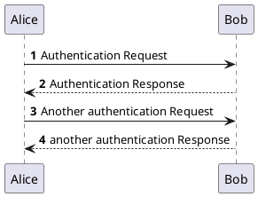
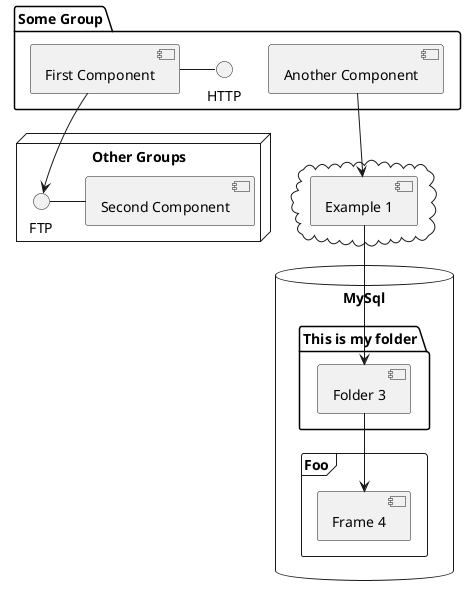

### 1 起因

起因是，我想要给我的博客加上plantUML渲染支持，因为很多时候图表比纯文字直观很多

但是比较麻烦的是，我通常使用jetbrains idea作为编辑器书写博客，而使用hexo做渲染

有必要找一些（若无，则做一些）新的工具链

### 2.1 hexo端

哇，竟然已经有带善人做了相应的hexo插件诶

那嫖来用一下就好了……好吧，其实不太行

https://github.com/two/hexo-tag-plantuml

因为idea的plantuml要求以\`\`\`plantuml开头的注释段

但是这个插件希望要的是

```html

Alice -> Bob: Authentication Request

```

这种

所以导致如果想要像我一样多端，那么看来是不能用这个了

……当我开始准备好自己写js的时候，奇迹发生了

https://github.com/search?q=hexo+plantuml

搜索hexo plantuml，竟然获得了已经实现了的版本，并且还是两个老哥分别实现了……

https://github.com/miao1007/hexo-filter-plantuml

和

https://github.com/add358/hexo-filter-markdown-plantuml

嗯，出于多种因素考虑，我们最终选择这个 https://github.com/miao1007/hexo-filter-plantuml

```shell
npm install --save hexo-filter-plantuml
```

爽到

### 2.2 idea端

博客是以markdown的形式管理的

这就要求编辑器需要能解析**内嵌在markdown文件内的plantuml**

所以很遗憾，idea端惯用的
[PlantUML integration](https://plugins.jetbrains.com/plugin/7017-plantuml-integration)
其实就不太合适

索性，在idea的官方文档中发现，idea自己的官方markdown插件是内置了plantuml和mermaid的支持的，只不过默认关闭

开启很简单，打开idea，[File | Settings | Languages & Frameworks | Markdown](jetbrains://idea/settings?name=Languages+%26+Frameworks--Markdown)

然后在`Markdown Extensions`栏里把能勾选的都勾上就完事了

值得注意的是，Jetbrains idea目前内置使用的plantuml.jar版本过低，所以不支持某些图。已经提pr给他们修了……

https://github.com/JetBrains/intellij-community/pull/1547

不知道什么时候能审核好呢（笑）

毕竟，你们人类的速度实在太慢了

嗯，如果等不及的人的话，可以先手动替换哦

先下载[新版本的plantuml.jar](https://repo1.maven.org/maven2/net/sourceforge/plantuml/plantuml/1.2021.5/plantuml-1.2021.5.jar)

然后用这个jar替换掉原本的jar

```
C:\Users\xenoa\AppData\Local\JetBrains\IntelliJIdea2021.1\download-cache\plantuml
```

最后清掉缓存（删除这个文件夹下的所有子文件&子文件夹即可）

```
C:\Users\xenoa\AppData\Local\JetBrains\IntelliJIdea2021.1\markdown\PlantUMLCodeGeneratingProvider
```


### 2.3 使用例

例1 代码:

```html
@startuml
'https://plantuml.com/sequence-diagram

autonumber

Alice -> Bob: Authentication Request
Bob --> Alice: Authentication Response

Alice -> Bob: Another authentication Request
Alice <-- Bob: another authentication Response
@enduml
```

例1 渲染效果:



例2 代码:

```html
@startuml
'https://plantuml.com/component-diagram


package "Some Group" {
  HTTP - [First Component]
  [Another Component]
}

node "Other Groups" {
  FTP - [Second Component]
  [First Component] --> FTP
}

cloud {
  [Example 1]
}


database "MySql" {
  folder "This is my folder" {
    [Folder 3]
  }
  frame "Foo" {
    [Frame 4]
  }
}


[Another Component] --> [Example 1]
[Example 1] --> [Folder 3]
[Folder 3] --> [Frame 4]

@enduml
```

例2 渲染效果:

