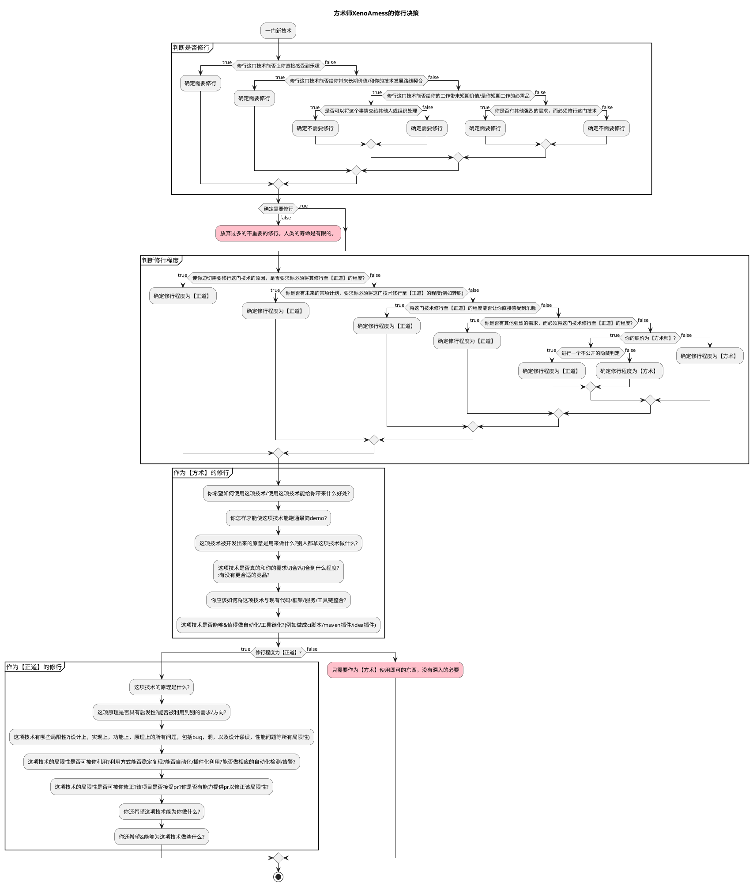

```plantuml

@startuml
title 方术师XenoAmess的修行决策

:一门新技术;
partition 判断是否修行 {
    if (修行这门技术能否让你直接感受到乐趣) then (true)
        :确定需要修行;
    else (false)
        if (修行这门技术能否给你带来长期价值/和你的技术发展路线契合) then (true)
            :确定需要修行;
        else (false)
            if (修行这门技术能否给你的工作带来短期价值/是你短期工作的必需品) then (true)
                if (是否可以将这个事情交给其他人或组织处理) then (true)
                    :确定不需要修行;
                else (false)
                    :确定需要修行;
                endif
            else (false)
                if (你是否有其他强烈的需求，而必须修行这门技术) then (true)
                    :确定需要修行;
                else (false)
                    :确定不需要修行;
                endif
            endif
        endif
    endif
}

if (确定需要修行) then (true)
else (false)
    #pink:放弃过多的不重要的修行。人类的寿命是有限的。;
    kill
endif

partition 判断修行程度 {
    if (使你迫切需要修行这门技术的原因，是否要求你必须将其修行至【正道】的程度?) then (true)
        :确定修行程度为【正道】;
    else (false)
        if (你是否有未来的某项计划，要求你必须将这门技术修行至【正道】的程度(例如转职)) then (true)
            :确定修行程度为【正道】;
        else (false)
            if (将这门技术修行至【正道】的程度能否让你直接感受到乐趣) then (true)
                :确定修行程度为【正道】;
            else (false)
                if (你是否有其他强烈的需求，而必须将这门技术修行至【正道】的程度?) then (true)
                    :确定修行程度为【正道】;
                else (false)
                    if (你的职阶为【方术师】?) then (true)
                        if (进行一个不公开的隐藏判定) then (true)
                            :确定修行程度为【正道】;
                        else (false)
                            :确定修行程度为【方术】;
                        endif
                    else (false)
                        :确定修行程度为【方术】;
                    endif
                endif
            endif
        endif
    endif
}

partition 作为【方术】的修行 {
    :你希望如何使用这项技术/使用这项技术能给你带来什么好处?;
    :你怎样才能使这项技术能跑通最简demo?;
    :这项技术被开发出来的原意是用来做什么?别人都拿这项技术做什么?;
    :这项技术是否真的和你的需求切合?切合到什么程度?
    :有没有更合适的竞品?;
    :你应该如何将这项技术与现有代码/框架/服务/工具链整合?;
    :这项技术是否能够&值得做自动化/工具链化?(例如做成ci脚本/maven插件/idea插件);
}

if (修行程度为【正道】?) then (true)
    partition 作为【正道】的修行 {
        :这项技术的原理是什么?;
        :这项原理是否具有启发性?能否被利用到别的需求/方向?;
        :这项技术有哪些局限性?(设计上，实现上，功能上，原理上的所有问题，包括bug，洞，以及设计谬误，性能问题等所有局限性);
        :这项技术的局限性是否可被你利用?利用方式能否稳定复现?能否自动化/插件化利用?能否做相应的自动化检测/告警?;
        :这项技术的局限性是否可被你修正?该项目是否接受pr?你是否有能力提供pr以修正该局限性?;
        :你还希望这项技术能为你做什么?;
        :你还希望&能够为这项技术做些什么?;
    }
else (false)
    #pink:只需要作为【方术】使用即可的东西，没有深入的必要;
endif

stop
@enduml

```
