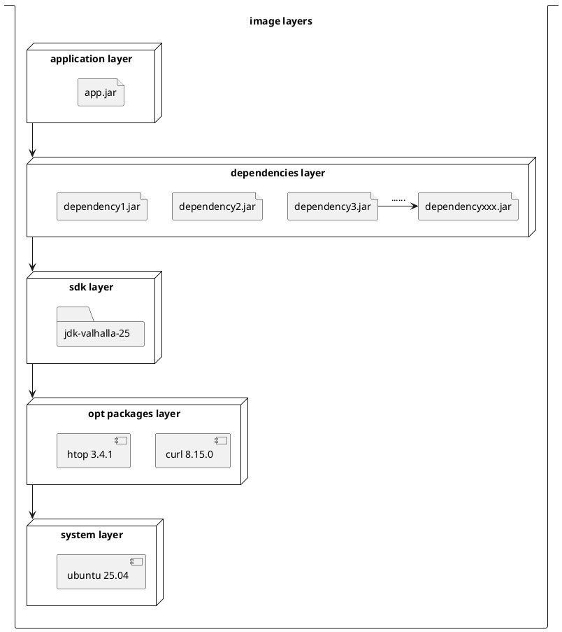
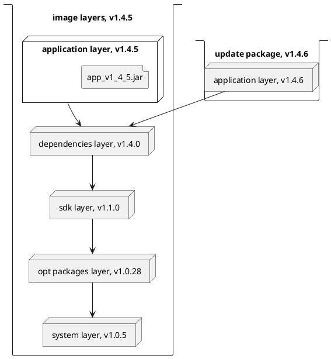
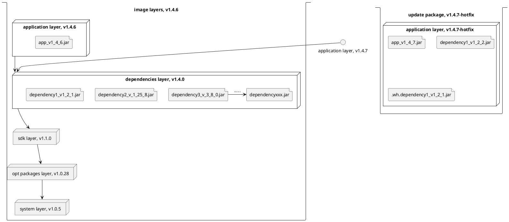
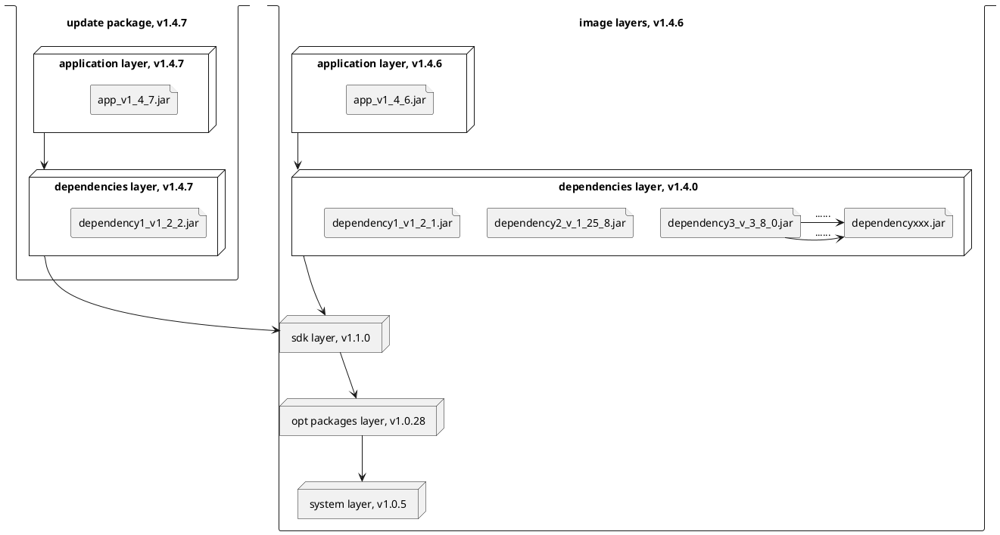
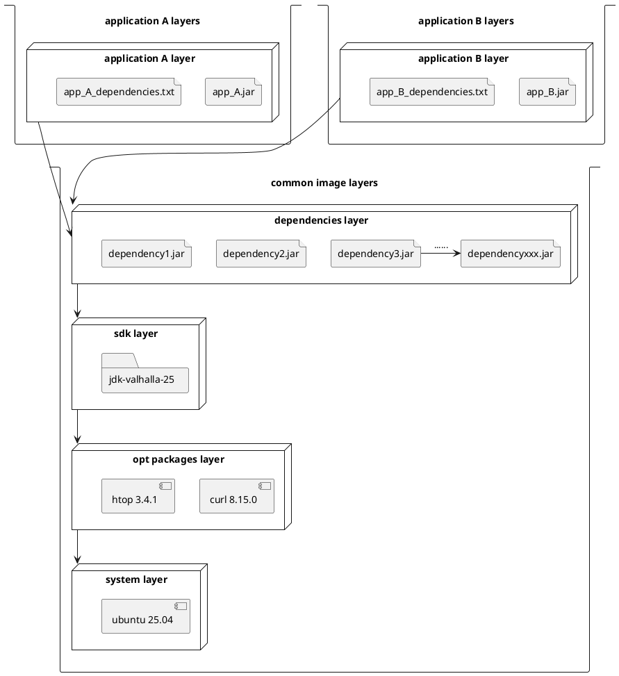
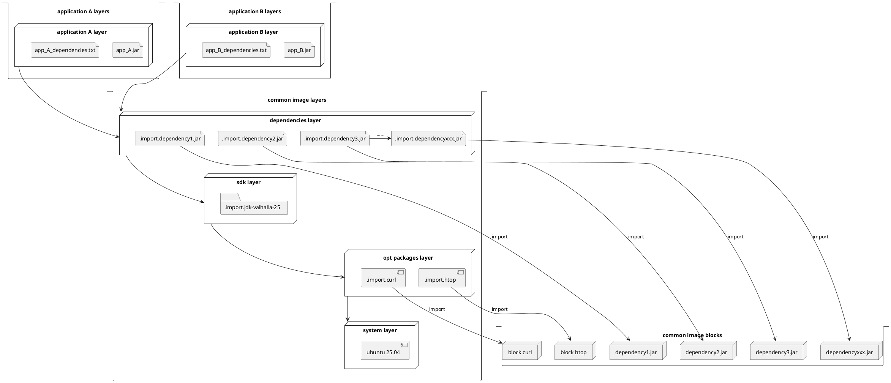

https://github.com/opencontainers/image-spec/issues/1270

# OCI image-spec, Issue 1270: request to add an import mechanism to oci image format, to reduce bandwidth cost on image upgrades

# 1. The problem

For example, now you be an architect, holding a java application (or a python one, not really matters), depend on 100+
jar dependencies,
which dependency has a file size at about 200kb—50mb.

And as you need to distribute this application as a docker image, you want to make the bandwidth transfer as efficient
as possible.

For our long-term customer, you need to make the update package as small as possible, so that they can update the
application with the least bandwidth cost.

(actually the real situation I'm facing here is this is not network transfer, but local usb installer package transfer (
due to security reason), but the principle is the same.).

# 2. Ways to handle

## 2.1 Easiest thought: layer split based on hot and cold isolation

The usual way, witch most people can reach, and most small companies/groups be using, is layer split.

Just split the big application image into multiple layers, like the graph below

| name               | content                                                                             | cost(experience value) |  
|--------------------|-------------------------------------------------------------------------------------|------------------------| 
| application layer  | application                                                                         | 200kb-10mb             |
| dependencies layer | dependencies                                                                        | 10mb-1gb               |
| sdk layer          | jdk, or nodejs sdk, or python or something                                          | 50mb-200mb             |
| opt packages layer | additional packages installed, like newer version of curl, git, vim, font types etc | 0mb-100mb              |
| system layer       | system                                                                              | 20mb-200mb             |



Well depending on the size of the group (and situations of the application itself), the number of layers can be more
or less, but the principle is the same.

The principle is, the more top layers be hotter, and the more bottom layers be colder, as the bottom layers are more
stable and less frequently changed.

So in most cases (at least they have to think so, as there be no better solutions); the application bugfix, or feature
update, can be done in the application layer, thus makes bandwidth transfer smaller.



The problem is things do not always go this way.

A bugfix may need to upgrade a dependency, but wait, dependency is at the dependencies' layer.

You must choose, from either add the updated dependency into the new application layer, which breaks the promise;

or upgrade the dependency in the dependencies' layer, which means the updation's cost is the whole dependencies layer,
means you wanna upgrade a 200 kb lib, but actually cost you 500mb+ bandwidth

image for choice 1(hotfix, fast for short time but troublesome for long time):



image for choice 2(normal, with full dependency layer update):



For more severe situations, like, if your application, for example, facing a severe situation that need to upgrade the
sdk, or the opt package, or even the system, the cost would be unnecessarily high.

For a real world example, a third-party one-drive client application needs you to upgrade your curl...

So using this strategy, people always suffer from choices...

Be this package a hotfix? Be it hot enough to break the promise of layer split? Should we upgrade the dependency layer
or not?

## 2.2 More complex and more sorrow.

Now your business grows larger. You have several groups which each be taking care of several applications.
Of course, you be in microservice system, and each group holding several repos, which repo containing one or several
applications.

Notice that your several groups have their own dependencies/dependency management system, and they are not meant to be
using the same version of the
same lib.

(due to compatibility reason usually, as semver not always be followed correctly...).
So a natural way for you seems to be like this:



But as you can see, it actually enlarges the problems described in section 2.1 ...

Now you have to take care not only the original problems (for several groups), but also have to think about: for when to
merge the dependency layer, when to allow business groups to add dependencies in their own application layer? How to
handle when some bussiness must upgrade some dependency, which the other bussiness group have no need&time to upgrade?

So as your business grows larger, the problems become more complex, and the cost of updating becomes higher.

And yes, you got stuck, and start to notice this solution takes an architect/expert to handle and balance all the
business groups, not an one-time job, but a long-term work ...

As we all know, this kind of guy is usually costly, and shall be put into more important position, not be wasting time
on things like this...

## 2.3 What would some people do in this situation

### 2.3.1 extract the files from image, transform, then re-package the image.

The problem is mainly for the cost of the image repacking, as tar is a very slow file format, and so does gzip.

So your customer might suffer from the long time of installing for image repacking, which is not acceptable for some of
them.

### 2.3.2 deploy an additional file server, register dependency files, and request dependencies when pod start-up.

The problems be,

1. This stage might take more time in bad network conditions / bad disk
2. Pod startup → request avalanche.The file server might be a single point of failure.
3. Bad for disk(ssd especially)
4. Complexity

# 3. A far better way on this

Why doesn't oci support this kind of things natively?

## 3.1 The feature needed on oci part

1. as we do accept `.wh.` files, I think it be not bad to add another grammar as `.import.` files, for example
   `.import.abcde.txt`
2. in the `.import.abcde.txt` file we describe which file/folder is imported from which `block`
   for example,

```
/root/data/abcde.txt from sha256:b5b2b2c507a0944348e0303114d8d93aaaa081732b86451d9bce1f432a538888
``` 

3. describe the `blocks` into image manifest

```
{
  "schemaVersion": 2,
  "mediaType": "application/vnd.oci.image.manifest.v1+json",
  "config": {
    "mediaType": "application/vnd.oci.image.config.v1+json",
    "digest": "sha256:b5b2b2c507a0944348e0303114d8d93aaaa081732b86451d9bce1f432a537bc7",
    "size": 7023
  },
  "layers": [
    {
      "mediaType": "application/vnd.oci.image.layer.v1.tar+gzip",
      "digest": "sha256:9834876dcfb05cb167a5c24953eba58c4ac89b1adf57f28f2f9d09af107ee8f0",
      "size": 32654
    },
    {
      "mediaType": "application/vnd.oci.image.layer.v1.tar+gzip",
      "digest": "sha256:3c3a4604a545cdc127456d94e421cd355bca5b528f4a9c1905b15da2eb4a4c6b",
      "size": 16724
    },
    {
      "mediaType": "application/vnd.oci.image.layer.v1.tar+gzip",
      "digest": "sha256:ec4b8955958665577945c89419d1af06b5f7636b4ac3da7f12184802ad867736",
      "size": 73109
    }
  ],
//here
"blocks": [
    {
      "mediaType": "application/vnd.oci.image.layer.v1.tar+gzip",
      "digest": "sha256:b5b2b2c507a0944348e0303114d8d93aaaa081732b86451d9bce1f432a538888",
      "size": 12345
    }
],
//here
  "subject": {
    "mediaType": "application/vnd.oci.image.manifest.v1+json",
    "digest": "sha256:5b0bcabd1ed22e9fb1310cf6c2dec7cdef19f0ad69efa1f392e94a4333501270",
    "size": 7682
  },
  "annotations": {
    "com.example.key1": "value1",
    "com.example.key2": "value2"
  }
}

```

4. store `block` using a samilar way to the layers (as it can also be seen as some file patches)

In this way, we give opportunity to image makers to share common libs into `block`s, and share them between multiple
images's multiple layers.

## 3.2 The feature needed on the image maker side

Simply make some tool chains, to embedding the dependencies into blocks, and distribute it.

And then make some plugins to import the blocks when building the image from microservice artifact.



# 4. Why the original design...?

Oci inherited the format from docker, and were following docker's original design...

Well, docker's original design doesn't have a mind of such things.

Come to think of it, go people usually do not have enough ability/habit to use dynamic link/another dynamic dependency
mechanism, they tend to use a single binary file as compiler output (the GOreat is simple, they said).

That might be why the original design ignores things like this.

Well I can't stop to think if cpp/c/objc/rust/java/python/c#/ts/js/ people were in charge of the design, they might have
thought about this. But go people, well.
